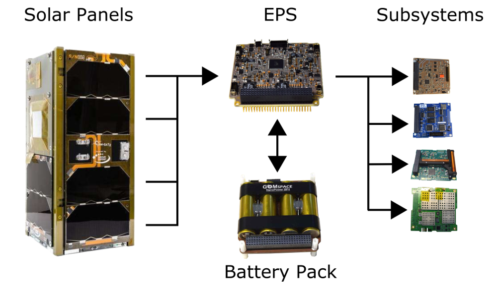
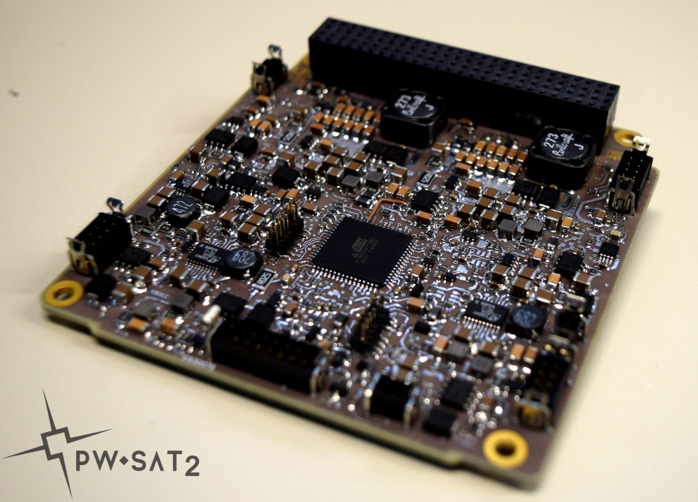
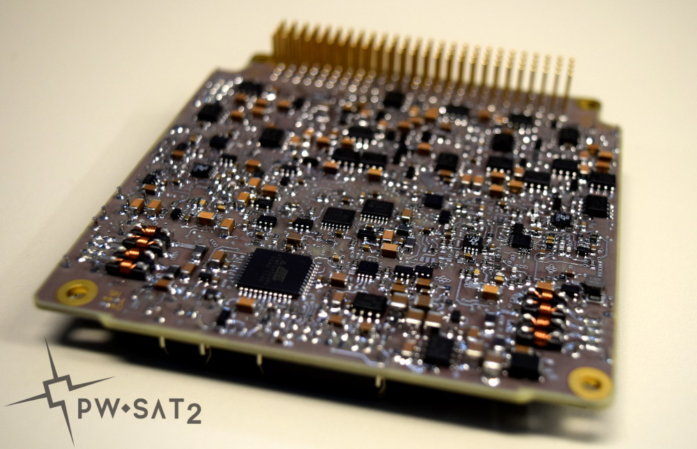

# EPS - Electrical Power System
The EPS subsystem was designed to perform the following tasks: power harvesting, energy storage, power conditioning and distribution. The EPS PCB was designed by the PW-Sat2 team, intlc. hardware and software.

# EPS flight design
1. Flight EPS PCB design can be found in `./pcb/trunk/*`.
2. Last, flight AVR source code can be found here: [GitHub.com/PW-Sat2/avr/tree/EPSv1.0](https://github.com/PW-Sat2/avr/tree/EPSv1.0) - it depends on [our AVR-HAL](https://github.com/PW-Sat2/AVR-HAL):
   * [EPS_A](https://github.com/PW-Sat2/avr/tree/EPSv1.0/EPS_A) - Source code for main, EPS A microcontroller, i.e. ATMega128L.
   * [EPS_B](https://github.com/PW-Sat2/avr/tree/EPSv1.0/EPS_B) - Source code for redundant, EPS B microcontroller, i.e. ATMega324PV.
   
**EPS flight PCB top view:**

**EPS flight PCB bottom view:**

# Schematics and PCB layout
* Altium Designer project files: `pcb/trunk/*`,
* Exported PDF: [pcb/trunk/Project-Documentation/EPS.pdf](pcb/trunk/Project-Documentation/EPS.pdf)

# Credits
* Schematics and PCB layout - Piotr Kuligowski @pkuligowski
* Schematics review - Grzegorz Gajoch @ggajoch

