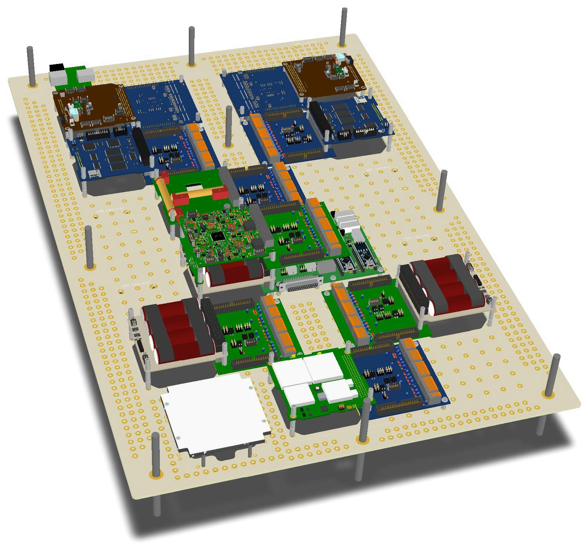
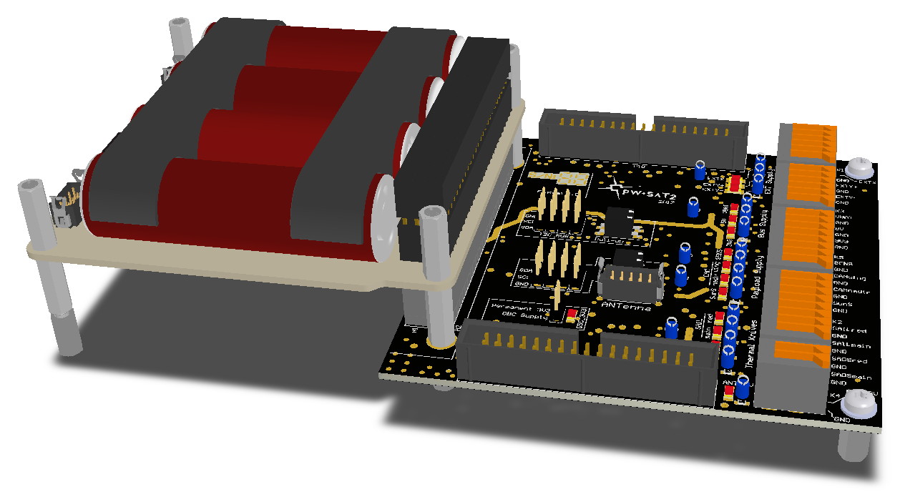

# Flatsat - Flat PW-Sat2 electrical assembly
Flatsat assembly allows to test all subsystems functionally. It consists of flight or engineering subsystems or mocks in a mechanically rigid assembly. Flatsat assebly consists of two parts: flatsat frame and PC-104 breadboard.

# Flatsat frame
Large, laser cut aluminum frame with places to screw all subsystems and EGSE.

**Frame design**

* Frame was designed in Altium Designer: `frame/*`.

# PC-104 breadboard
PC-104 subsystems are plugged into a PC-104 breadboard which allows to connect standard cubesat subsystems in a series with standard IDC cables. It simulates PC-104 stack connection in a standard cubesat system and allows to do electrical measurements on all PCBs.

**Schematics and PCB layout**

* Altium Designer project PCB files: `pcb/*`,
* Exported PDF: [pcb/Project-Documentation/Flatsat.pdf](pcb/Project-Documentation/Flatsat.pdf)

# Credits
* Frame design, schematics and PCB layout - Piotr Kuligowski @pkuligowski
* Design review - Grzegorz Gajoch @ggajoch and Michał Gumiela
