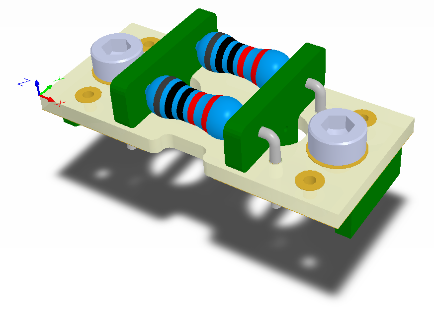
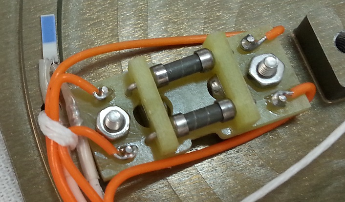
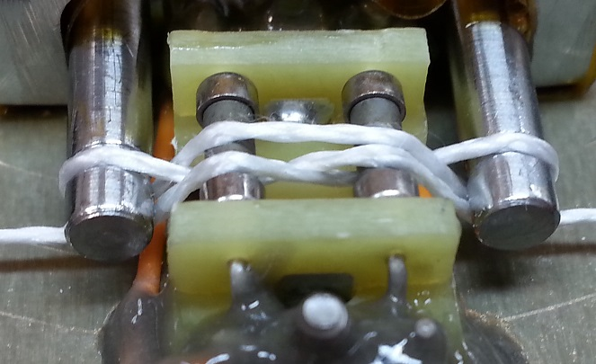

# Thermal Knife
Thermal knife is used to cut a Dyneema fibre. The Dyneema fibre holds a mechanism which will be deployed in orbit. The thermal knife assembly consists of three parts: main board with resistors, holders and washers. Full assembly:

# Application
In this system the thermal knife is used to hold two deployable mechanisms during launch:
* SARM - Solar Arrays Release Mechanism
* SRM - Sail Release Mechanism.

Thermal knife during SRM assembly:

Thermal knife inside the SRM mechanism in flight configuration:
