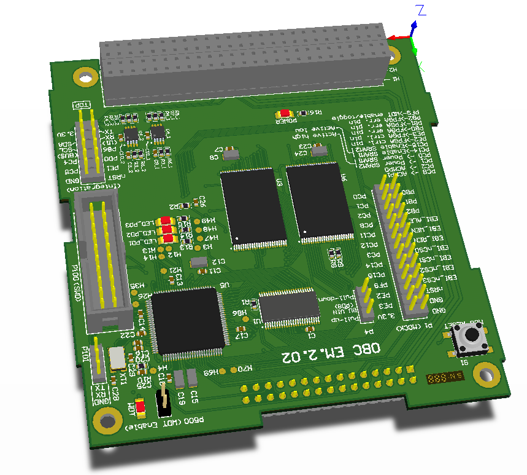

# On-Board Computer development board
This OBC dev board was designed to speed up software development process. It is software-compatible with the flight OBC but there are significant differences in hardware. SRAM EDAC and latch-up protections were not implemented. So it is not ready to launch but it successfully mocks the real OBC. In addition, there are additional debug LEDs and connectors.

# Schematics and PCB layout
* Altium Designer project files: `pcb/*`,
* Exported PDF: [pcb/Project-Documentation/OBC.pdf](pcb/Project-Documentation/OBC.pdf)

# Known bugs
* XT1 (8MHz oscillator for EFM32) footprint is mirrored,
* Flight OBC was not 100% compliant with its own datasheet. Few GPIOs on PiggyBack were swapped in software.

# Credits
* Schematics - Piotr Kuligowski @pkuligowski
* Schematics review - Grzegorz Gajoch @ggajoch
* PCB Layout - FP Instruments and Piotr Kuligowski @pkuligowski
