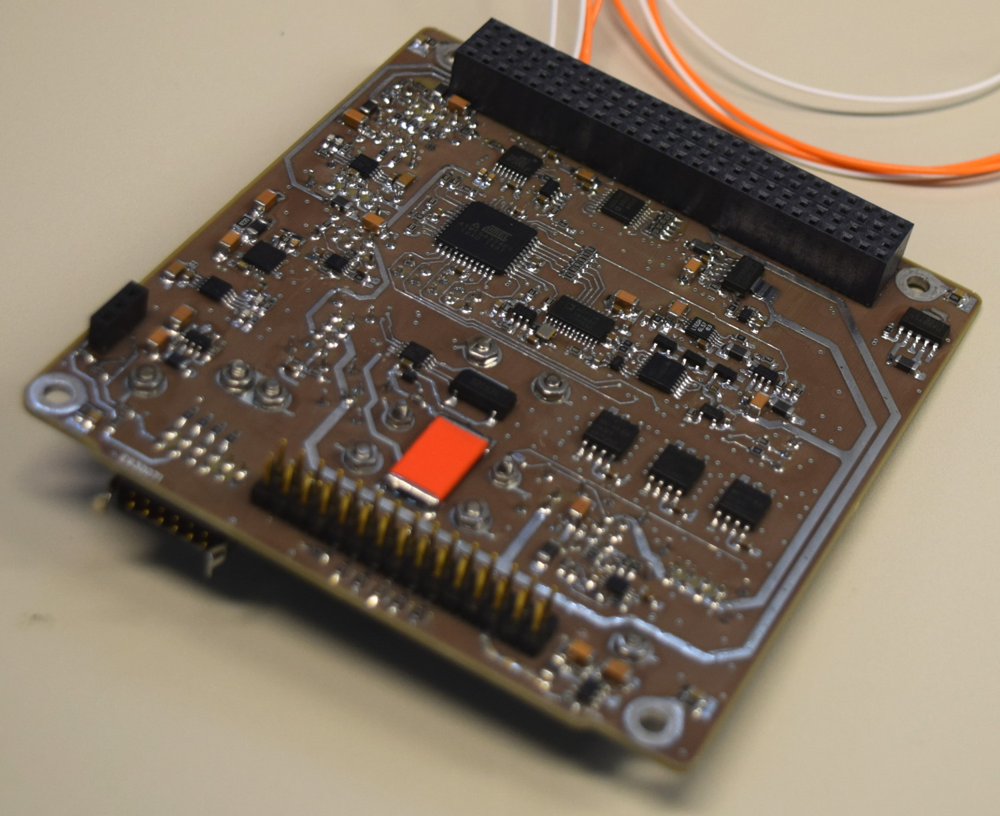

# PLD - Payload board

Payload board contains several important circuits for bus and payload subsystems, including:

* Flash and fram memory for on-board computer,
* Real-time clock (with I2C bus isolator),
* Gyroscope (with I2C bus isolator),
* Multiplexer for cameras,
* Experimental SunS interface (with I2C bus isolator),
* Reference Sun Sensor signal conditioning,
* Photodiodes biasing and signal conditioning,
* Temperature sensors (on cameras, sail container, solar panels) biasing and conditioning,
* SADS (deployable solar panels) thermal knifes,
* RadFET - TID experimental sensor,
* RBL switch,
* Access port.

# PLD versions

* **PLD DM** - Demonstration model, mainly intended to support software development by OBC Team,
* **PLD PFM 1.01** - Working board with all functionalities with several minor issues,
* **PLD PFM 2.02** - Issues discovered on previous version fixed, UART debug port for AVR added, kill switch accessible via access port.

# Software

* Embedded flight software for [PLD AVR](https://github.com/PW-Sat2/avr/releases/tag/PLDv1.0)

# Credits

* Schematic and PCB: Grzegorz Gajoch, Piotr Kuligowski, supported by Michał Gumiela
* Assembly and tests: Michał Gumiela

* SADS Thermal knife design & assembly: Piotr Kuligowski
* RadFET design: Grzegorz Gajoch, Michał Gumiela
