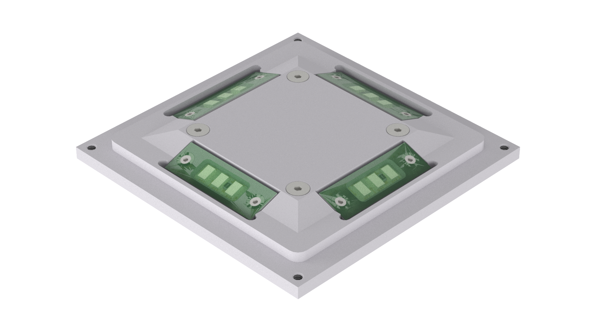

# SunS - Experimental Sun Sensor
The SunS was designed as a cheap, easy-to-build coarse Sun Sensor suitable for CubeSat application. It features two-axis measurement, wide-angle FOV, measurement accuracy better than 5 degrees and CubeSat standard compatible I2C bus.

# SunS versions

* **SunS EM1.01** - very first version, intended to be stricly integrated with Test Stand,
* **SunS EM2.02** - more standalone version of EM1.01, never produced (see desc in the version folder),
* **SunS DM1** - demonstration model of the SunS, main aim: a very first feasibility studies on repleacing solar cells with ambient light sensors (ALS),
* **SunS EM3.03** - third engineering model of the SunS, however it's the first EM version after major system modification,
* **SunS EM4.04** - improved version of EM3.03 in terms of schematic and PCB, all main components remained the same, fully operational, the design qualified as Flight Model design,
* **SunS FM** - actually not a new design/version, but a new item build and qualified as flight model.

NOTE: EM 1.01 utilizes solar cells intead of ambient light sensors, EM 2.02 was the second iteration of the sensor using solar cells (never produced, repleaced by SunS DM1).

# EGSE (Electrical Ground Support Equipment)

* **SunS WiFi EGSE** - I2C to TCP/IP via WiFi adapter, suitable for **SunS EM4.04/FM** - used during angular calibrations of SunS to get rid of cables between the SunS (DUT) and PC computer (data aquisition),
* **[SunS Fixture EGSE](electrical_design/SunS_EM4.04_FM/SunS_fixture_EGSE/2017-05-manufactured_SunS_fixture_EGSE_1.01)** - used to test **SunS EM4.04/FM** firmware and hardware during assembly.

# Software

### SunS EM3.03

* Embedded software for [SunS EM3.03](https://github.com/PW-Sat2/SunS-EM3.03-AVR)
* Embedded software for [SunS EM3.03 EGSE](https://github.com/PW-Sat2/SunS-EM3.03-EGSE)

### SunS EM4.04/FM

* Embedded software for [SunS EM4.04/FM](https://github.com/PW-Sat2/avr/releases/tag/SunSv1.0)
* Embedded software for [SunS EM4.04/FM WiFi EGSE](https://github.com/PW-Sat2/SunS-WiFi-EGSE)
* PC software for [SunS EM4.04/FM Test Stand](https://github.com/PW-Sat2/SunS-EM3.03-EGSE)

# Credits

* Early, conceptual design: Inna Uwarowa
* Electronics of Test Stand, Demonstration Models Electronics (prototypes): Piotr Kuligowski
* Turntable mechanics: Artur Łukasik
* Mechanical design, photonics, calibration: Mateusz Sobiecki
* Electronics design and assembly, software design, calibration: Michał Gumiela
