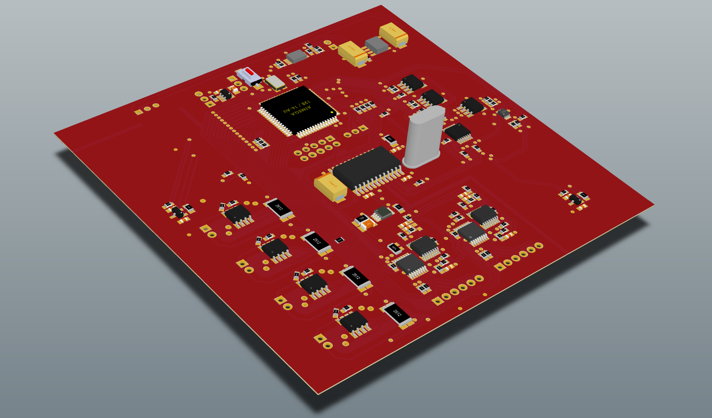

# SunS EM 2.02
Second major (and never manufactured) version of PW-Sat2 Sun Sensor design. Four solar cells are used as light intensity sensors. It was a more standalone version comparing to EM 1.01. Never manufactured because of several problems with solar cells (among others: cutting them to proper size, facing unpredictable parameters variations, high power usage in biased mode, etc.). After this version the design was revised resulting in SunS DM model. 

# Credits

* electronics design: Grzegorz Gajoch, Michał Gumiela, Piotr Kuligowski
